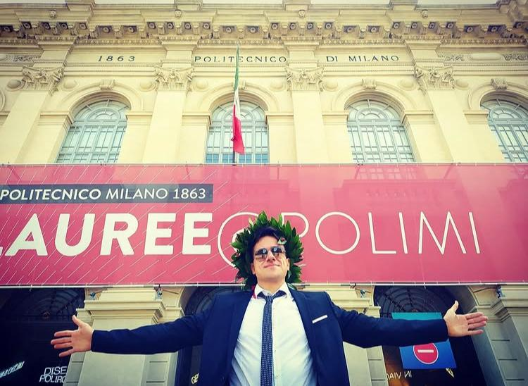

<!-- Embedded CSS -->

<nav>
  <ul>
    <li><a href="{{ site.baseurl }}/contacts">Contacts</a></li>
    <li><a href="{{ site.baseurl }}/publications">Publications & Patents</a></li>
  </ul>
</nav>

<header>
  <h1>Raffaele Giuseppe Cestari, Ph.D.</h1>
  
<em>Postdoctoral Researcher <a href="https://polimi.it/">@Polimi</a> in Data-driven Control for Financial Trading</em>

  
<em>Ph.D. cum Laude in Information Technology</em>

  
<em>MSc in Automation and Control Engineering (110/110 cum Laude)</em>

  
<em>Bachelor in Mechanical Engineering</em>

  

  
  

</header>

<section id="about">
  <h2>About Me</h2>

  
<strong>Download my CV <a href="assets/docs/CV.pdf" target="_blank">here</a>!</strong>

  
I took a study path in Engineering because I have been passionate about technology since I was a boy. Initially, I obtained a <strong>bachelor’s degree in Mechanical Engineering</strong>. Growing up, I had the opportunity to become ardent about the world of <strong>Information Technology</strong>. This pushed me to undertake a <strong>master’s degree in Automation and Control engineering</strong>, which I achieved with full marks and honors. In this track, I had the opportunity to enter the world of <strong>machine learning</strong> and <strong>data analysis</strong>, for which I felt the need to deepen my knowledge and become an expert.

  
After a short but significant internship experience as a <strong>Data Engineer</strong> at <strong><a href="https://www.exacon.it/">Exacon - Information Technology</a> (Milan, Italy)</strong>, where I learned the fundamentals of <strong>data engineering</strong> (<strong>ETL</strong>, <strong>Spark</strong>, <strong>Hadoop Ecosystem</strong>), I decided to undertake a <strong>PhD in Information Technology</strong>. In this last phase, I had the opportunity to tackle several machine learning, time-series forecasting, and predictive control problems in different applications (finance, energy) and optimization problems (management of AGV robots and aircraft fleet) and also big data analytics problems (study of the driving behavior of about 100,000 people on the Italian national territory starting from GPS data).

  
During the PhD, I also had experiences that significantly enhanced my technical and soft skills; I attended and successfully passed a PhD course on Learning-based Predictive Control at <a href="https://ethz.ch/en.html">ETH Zurich</a>. I also had the privilege of conducting my doctoral research activities at <a href="https://www.cornell.edu/">Cornell University</a> (New York) for 3 months. This adventure allowed me to interact with engineers and professors of international importance. This experience left an indelible mark on my character.

  
I had the opportunity to participate in high-level and international scientific conferences where I could present my research in <strong>Milan</strong>, <strong>Boston</strong>, and <strong>Thessaloniki</strong>. For four consecutive editions, I have been the <strong>teaching assistant</strong> for the <strong>Fundamentals of Automatic Control course</strong> at the <strong>Politecnico di Milano</strong>. Teaching an engineering class (bachelor’s) with an audience of about a hundred students has allowed me to master the ability to convey complex topics concisely and effectively.

  
The doctorate was not only an opportunity to interact with the scientific world. I had the chance to work with several high-level corporate realities. I attended a conference in <strong>Bari (Italy)</strong>, where I presented the study conducted on private mobility to the city authorities. I interacted with professionals from <strong>Tenaris</strong>, <strong>UnipolTech</strong>, <strong>CNH Industrial</strong>, <strong>KPMG</strong>, <strong>Fives Intralogistics</strong>, and <strong>Intesa San Paolo</strong> on various industrial projects I carried out during these years of research/study and work. These tasks allowed me to practice the strong theoretical foundations I have acquired.

</section>
