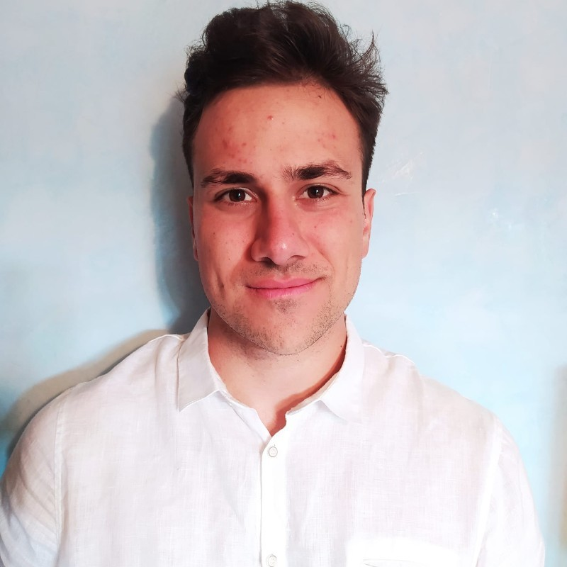

<header>
  <h1>Raffaele Giuseppe Cestari, Ph.D.</h1>
  
Post-doc Researcher @Polimi in Machine Learning & Predictive Control

</header>

<section id="about">
  <h2>About Me</h2>
  
  
I took a study path in Engineering because I have been passionate about technology
    since I was a boy. Initially, I obtained a bachelor’s degree in Mechanical Engineering. Growing up, I
    had the opportunity to become ardent about the world of Information Technology. This pushed me to
    undertake a master’s degree in Automation and Control engineering, which I achieved with full marks
    and honors. In this track, I had the opportunity to enter the world of machine learning and data analysis,
    for which I felt the need to deepen my knowledge and become an expert. After a short but significant
    internship experience as a Data Engineer at Exacon - Information Technology (Milan, Italy), where I
    learned the fundamentals of data engineering (ETL, Spark, Hadoop Ecosystem), I decided to under-
    take a PhD in Information Technology. In this last phase, I had the opportunity to tackle several machine
    learning, time-series forecasting, and predictive control problems in different applications (finance, en-
    ergy) and optimization problems (management of AGV robot fleet and military aircraft fleet) and also big
    data analytics problems (study of the driving behavior of about 100,000 people on the Italian national
    territory starting from GPS data). During the PhD, I also had experiences that significantly enhanced my
    technical and soft skills; I attended and successfully passed a PhD course on Learning-based Predictive
    Control at ETH Zurich. I also had the privilege of conducting my doctoral research activities at Cornell
    University in New York for 3 months. This adventure allowed me to interact with engineers and profes-
    sors of international importance. This experience left an indelible mark on my character. I had the
    opportunity to participate in high-level and international scientific conferences where I could present my
    research in Milan, Boston, and Thessaloniki. For four consecutive editions, I have been the teaching
    assistant for the Fundamentals of Automatic Control course at the Politecnico di Milano. Teaching an
    engineering class (bachelor’s) with an audience of about a hundred students has allowed me to master
    the ability to convey complex topics concisely and effectively. The doctorate was not only an opportunity
    to interact with the scientific world. I had the chance to work with several high-level corporate realities.
    I attended a conference in Bari (Italy), where I presented the study conducted on private mobility to the
    city authorities. I interacted with professionals from Tenaris, UnipolTech, CNH Industrial, KPMG, Fives Intralogistics, and Intesa San Paolo on various industrial projects I carried out during these years of research/study and work. 
    These tasks allowed me to practice the strong theoretical foundations I have acquired.

  
<a href="assets/docs/CV.pdf" target="_blank">Download CV</a>

</section>

<section id="publications">
  <h2>Publications</h2>
  <ul>
    <li>
      <strong>Split-boost neural networks</strong> 
      <em>20th IFAC Symposium on System Identification SYSID 2024: Boston, United States, July 17-19, 2024</em> 
      <em>R. G. Cestari, G. Maroni, L. Cannelli, D. Piga, S. Formentin</em> 
      <a href="https://doi.org/10.1016/j.ifacol.2024.08.535">[DOI]</a>
    </li>
    <li>
      <strong>Vertical load estimation in tractors via in-wheel optical sensing</strong> 
      <em>20th IFAC Symposium on System Identification SYSID 2024: Boston, United States, July 17-19, 2024</em> 
      <em>R. G. Cestari, A. Lucchini, E. Leati, M. Norgia, S. Formentin, S.M. Savaresi</em> 
      <a href="https://doi.org/10.1016/j.ifacol.2024.08.584">[DOI]</a>
    </li>
    <li>
      <strong>Model Predictive Control with adaptive resilience for Denial-of-Service Attacks mitigation on a Regulated Dam </strong> 
      <em>2024 IEEE 63rd Conference on Decision and Control (CDC)</em> 
      <em>R. G. Cestari, S. Longari, S. Zanero, S. Formentin</em> 
      <a href="https://doi.org/10.1109/CDC56724.2024.10886552">[DOI]</a>
    </li>
    <li>
      <strong>Scenario-based model predictive control of water reservoir systems</strong> 
      <em>3rd Modeling, Estimation and Control Conference MECC 2023: Lake Tahoe, USA, October 2-5, 2023</em> 
      <em>R. G. Cestari, A. Castelletti, S. Formentin</em> 
      <a href="https://doi.org/10.1016/j.ifacol.2023.12.043">[DOI]</a>
    </li>
    <li>
      <strong>Hourly operation of a regulated lake via Model Predictive Control</strong> 
      <em>2nd IFAC Workshop on Control Methods for Water Resource Systems CMWRS 2022: Milano, Italy, 22–23 September 2022</em> 
      <em>R. G. Cestari, A. Castelletti, S. Formentin</em> 
      <a href="https://doi.org/10.1016/j.ifacol.2022.11.002">[DOI]</a>
    </li>
    <li>
      <strong>Non-linear multi-objective Bayesian MPC of water reservoir systems</strong> 
      <em>European Journal of Control Volume 83, May 2025</em> 
      <em>R. G. Cestari, A. Castelletti, S. Formentin</em> 
      <a href="https://doi.org/10.1016/j.ejcon.2025.101205">[DOI]</a>
    </li>
  </ul>
</section>

<section id="contact">
  <h2>Contact</h2>
  <ul>
    <li>Email: raffaele_cestari@hotmail.com, raffaelegiuseppe.cestari@polimi.it</li>
    <li><a href="https://github.com/RaffaeleGiuseppeCestari">GitHub</a></li>
    <li><a href="https://orcid.org/0009-0000-5948-0254">ORCID</a></li>
    <li><a href="www.linkedin.com/in/raffaele-giuseppe-cestari">LinkedIn</a></li>
  </ul>
</section>

<footer>
  
&copy; 2025 Raffaele Giuseppe Cestari, Ph.D.

</footer>
